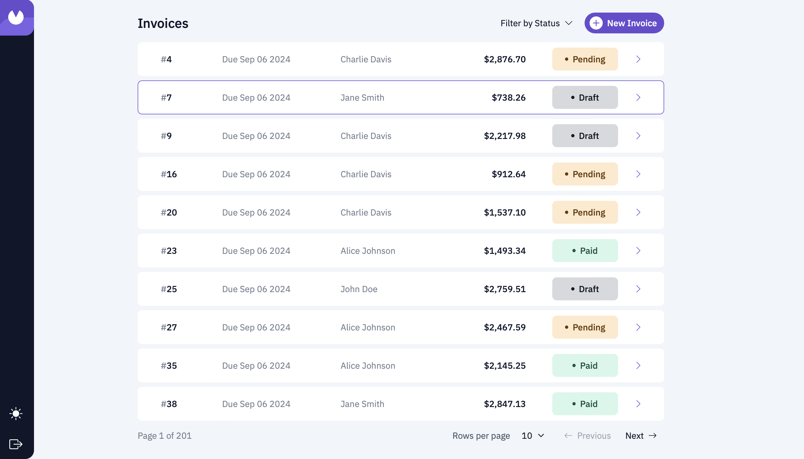

# Invoicer



Invoicer is my solution to [Frontend Mentor's Invoice app](https://www.frontendmentor.io/challenges/invoice-app-i7KaLTQjl) challenge. The motivation for this project was to explore full-stack, enterprise-grade React tech while crafting a complex, highly polished UI. This app is built using React, TypeScript, Remix, Refine, Supabase, and Bootstrap.

## Available Scripts

### Running the development server.

```bash
    npm run dev
```

### Building for production.

```bash
    npm run build
```

### Running the production server.

```bash
    npm run start
```

## License

MIT
