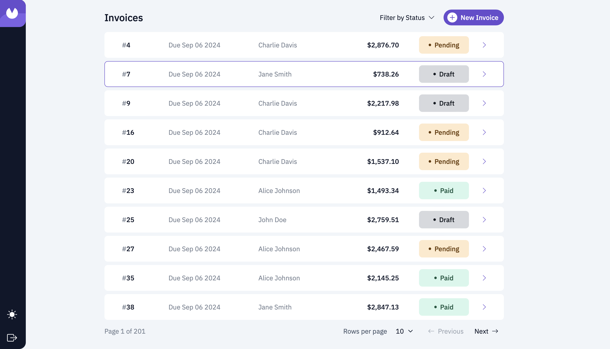

# Invoicer



Invoicer is my solution to [Frontend Mentor's Invoice app](https://www.frontendmentor.io/challenges/invoice-app-i7KaLTQjl) challenge. The motivation for this project was to explore full-stack, enterprise-grade React tech while crafting a complex, highly polished UI. This app is built using React, TypeScript, Remix, Refine, Supabase, and Bootstrap.

## Available Scripts

Create a `.env` file from `.env.example` and set the required Supabase values before starting the app. Set `RESEND_API_KEY` in the Supabase Edge Function environment before deploying `send-invoice`.

The demo login uses `DEMO_EMAIL` and `DEMO_PASSWORD` on the server. Demo data is restored daily by the operational `reset-demo-data` Supabase Edge Function. See `supabase/functions/reset-demo-data/README.md` for deployment, dashboard invocation, and scheduling instructions.

### Running the development server.

```bash
    npm run dev
```

### Building for production.

```bash
    npm run build
```

### Running the production server.

```bash
    npm run start
```

## License

MIT
