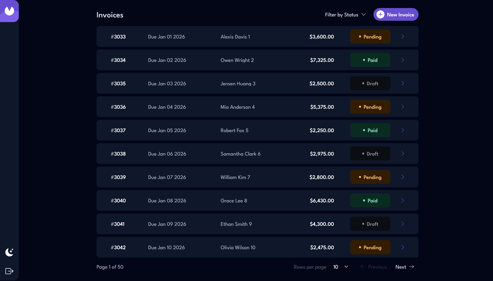

# Frontend Mentor - Invoicer

This is a solution to the [Invoice app challenge on Frontend Mentor](https://www.frontendmentor.io/challenges/invoice-app-i7KaLTQjl). Frontend Mentor challenges help you improve your coding skills by building realistic projects. 

## Table of contents

- [Overview](#overview)
  - [The challenge](#the-challenge)
  - [Screenshot](#screenshot)
  - [Links](#links)
- [My process](#my-process)
  - [Built with](#built-with)
  - [What I learned](#what-i-learned)
  - [Continued development](#continued-development)
  - [AI Collaboration](#ai-collaboration)
- [Available Scripts](#available-scripts)
- [License](#license)

## Overview

### The challenge

Users should be able to:

- View the optimal layout for the app depending on their device's screen size
- See hover states for all interactive elements on the page
- Create, read, update, and delete invoices
- Receive form validations when trying to create/edit an invoice
- Save draft invoices, and mark pending invoices as paid
- Filter invoices by status (draft/pending/paid)
- Toggle light and dark mode
- **Bonus**: Keep track of any changes, even after refreshing the browser (`localStorage` could be used for this if you're not building out a full-stack app)

### Screenshot



### Links

- Solution URL: [https://www.frontendmentor.io/solutions/full-stack-invoicing-app-lL47X4CUso](https://www.frontendmentor.io/solutions/full-stack-invoicing-app-lL47X4CUso)
- Live Site URL: [https://invoicer-murex.vercel.app/](https://invoicer-murex.vercel.app/)

## My process

### Built with

- React
- TypeScript
- Remix - Full-stack React framework
- Bootstrap - CSS and component library
- Supabase - Postgres Platform
- Refine - Headless meta-framework
- Vercel - Hosting & Deployment

### What I learned

- Server-side rendering with Remix
- Integrating server-side Supabase with Refine

### Continued development

- Digging deeper into Supabase
- Collaborating with more AI agents simultaneously

### AI Collaboration

I collaborated with AI using ChatGPT to modernize my original solution. This effort included:

- Moving Supabase's SDK server-side
- Wire together Remix loaders, Refine, and Supabase
- Adjust the font's baseline upwards
- Code-splitting invoice form logic
- Optimizing Bootstrap payload

Worktrees were great for accelerating productivity.

## Available Scripts

Create a `.env` file from `.env.example` and set the required Supabase values before starting the app. Set `RESEND_API_KEY` in the Supabase Edge Function environment before deploying `send-invoice`.

The demo login uses `DEMO_EMAIL` and `DEMO_PASSWORD` on the server. Demo data is restored daily by the operational `reset-demo-data` Supabase Edge Function. See `supabase/functions/reset-demo-data/README.md` for deployment, dashboard invocation, and scheduling instructions.

### Running the development server.

```bash
    npm run dev
```

### Building for production.

```bash
    npm run build
```

### Running the production server.

```bash
    npm run start
```

## License

MIT
